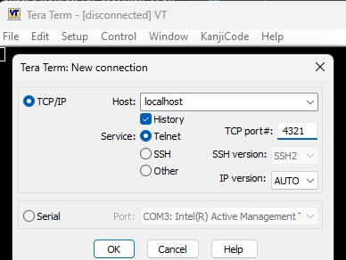

cpp-arm64-baremetal-machine-learning-playground
===============================================
### TODOs
- [ ] Use ringbuffer if needed
- [ ] realtime neural networks
  - [dirkarnez/cpp-neural-network-playground](https://github.com/dirkarnez/cpp-neural-network-playground)
  - [Kofybrek/Neural-network: A very simple neural network.](https://github.com/Kofybrek/Neural-network)
- [ ] time-series analysis (a new fork?)
  - time series databse
    - [带你五分钟看懂时序数据库！-PingCAP | 平凯星辰](https://cn.pingcap.com/article/post/2900.html)
    - [如何理解量化交易这样一份工作_量化交易产品经理-CSDN博客](https://blog.csdn.net/The_Time_Runner/article/details/104688850)
  - digital signal processing
- [x] Basic printf
- [ ] **Basic read_line**
- [ ] Mali GPU
  - [Arm Mali Offline Compiler User Guide](https://developer.arm.com/documentation/101863/0805/Using-Mali-Offline-Compiler/Compiling-OpenGL-ES-shaders?lang=en)
  - Arm Performance Studio 2024.4
    - `.\malioc  -c Mali-G72 triangle.frag`
- [ ] Vivante GPU
- [ ] Multicore
- [ ] SIMD
- [ ] GPIO
  - https://github.com/beckus/stm32_p103_demos/tree/master/demos
- [x] Semihosting USART communication
  - [**QEMU serial console**](https://www.uni-koeln.de/~pbogusze/posts/QEMU_serial_console.html)
  - [RT-Thread-qemu serial udp 无法通信RT-Thread问答社区 - RT-Thread](https://club.rt-thread.org/ask/question/ba9e73756a98ca4a.html)
  - [qemu 添加串口设备 qemu console_mob64ca13ff9303的技术博客_51CTO博客](https://blog.51cto.com/u_16213613/10599763)
  - [Running Bare Metal Applications on QEMU - Xilinx Wiki - Confluence](https://xilinx-wiki.atlassian.net/wiki/spaces/A/pages/821854273/Running+Bare+Metal+Applications+on+QEMU)
  - [dwelch67/qemu_arm_samples: bare metal ARM examples to be run with qemu-system-arm](https://github.com/dwelch67/qemu_arm_samples)
  - [PrimeCell UART (PL011) Technical Reference Manual r1p4](https://developer.arm.com/documentation/ddi0183/f/programmer-s-model/register-descriptions/flag-register--uartfr)
  - [c - UARTs & Registers - Stack Overflow](https://stackoverflow.com/questions/53714570/uarts-registers)
  - [PrimeCell UART (PL011) Technical Reference Manual r1p5](https://developer.arm.com/documentation/ddi0183/g/)
  - [PrimeCell UART (PL011) Technical Reference Manual r1p5](https://developer.arm.com/documentation/ddi0183/latest/)
  - [PL011 Peripheral Controller](https://developer.arm.com/Processors/PL011)
  - [Understanding UART | Rohde & Schwarz](https://www.rohde-schwarz.com/hk/products/test-and-measurement/essentials-test-equipment/digital-oscilloscopes/understanding-uart_254524.html)
  - [dirkarnez/atmega328p-uart](https://github.com/dirkarnez/atmega328p-uart)
- [ ] QEMU semihosting
  - [circle/lib/qemu.cpp at 749fe99301846217439a40ac7bda547a986db0f7 · rsta2/circle](https://github.com/rsta2/circle/blob/749fe99301846217439a40ac7bda547a986db0f7/lib/qemu.cpp#L34)
- [ ] update TBuild according to [`raw-build.cmd`](./raw-build.cmd)
- [ ] debugging via QEMU facilities

### (QEMU) baremetal projects
- [dwelch67/qemu_arm_samples: bare metal ARM examples to be run with qemu-system-arm](https://github.com/dwelch67/qemu_arm_samples)
- [rlangoy/ZedBoard-BareMetal-Examples: ZedBoard Bare Metal examples](https://github.com/rlangoy/ZedBoard-BareMetal-Examples)
- https://github.com/allexoll/BBB-BareMetal

### ARM
- https://github.com/DualTachyon/rk3588-secure-boot

### Android
- https://github.com/rabeeh/android-imx6-kitkat
### QEMU
- [qemu重定向串口serial - zephyr~ - 博客园](https://www.cnblogs.com/lvzh/p/17999381)

### Notes
- Dirty C macros
  - [Expose 'array_length()' macro in <sys/param.h>](https://gcc.gnu.org/pipermail/libstdc++/2020-September/051046.html)
  - [How do I determine the size of my array in C? - Stack Overflow](https://stackoverflow.com/questions/37538/how-do-i-determine-the-size-of-my-array-in-c)
- Floating points does not work
  - try `-mcpu=cortex-a72 -mlittle-endian -marm -mfpu=neon-fp-armv8 -mfloat-abi=hard`
  - It seems QEMU does not support hard float
  - may need armhf compiler
    - https://github.com/sjdh02/trOS/blob/7c64f086a5317c060c4e1b0e9de42ef8d3c2285a/build.zig#L15
    - https://github.com/jasonblog/note/blob/master/toolchain/173.md
    - https://blog.csdn.net/LEON1741/article/details/81537529
    - https://github.com/search?q=qemu-system-aarch64+float&type=code
- Interactivity
  - 
  - Uses `\r\n` for newline in serial
